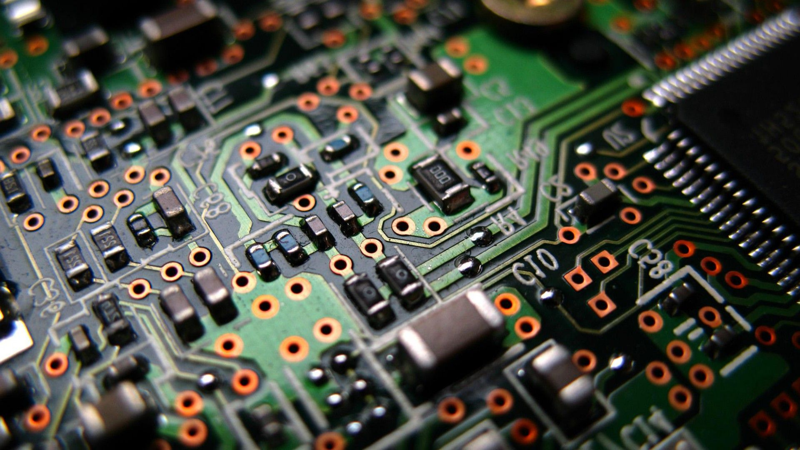

<!-- PROJECT LOGO -->
 

  

 
 

<!-- BACKGROUND & TITLE -->

  
  <h3 align="center">Embedded Design: Enabling Robotics</h3>
 

<!-- TABLE OF CONTENTS -->
## Table of Contents

* [**Notes**](https://github.com/MDBrodskiy/Embedded_Design/tree/master/Notes/)
    * [**Introduction to Embedded Design**](https://github.com/MDBrodskiy/Embedded_Design/tree/master/Notes/Section1.pdf)
    * [**Number System Conversion \& Binary Arithmetic**](https://github.com/MDBrodskiy/Embedded_Design/tree/master/Notes/Section2.pdf)
    * [**Digital Logic Circuits**](https://github.com/MDBrodskiy/Embedded_Design/tree/master/Notes/Section3.pdf)
    * [**Lab One Instructions**](https://github.com/MDBrodskiy/Embedded_Design/tree/master/Notes/Section4.pdf)
    * [**Digital Logic Circuits part 2**](https://github.com/MDBrodskiy/Embedded_Design/tree/master/Notes/Section5.pdf)
    * [**Digital Logic Circuits part 3**](https://github.com/MDBrodskiy/Embedded_Design/tree/master/Notes/Section6.pdf)
    * [**Adders, Subtractors, \& Multipliers**](https://github.com/MDBrodskiy/Embedded_Design/tree/master/Notes/Section7.pdf)
    * [**Digital Logic Minimization**](https://github.com/MDBrodskiy/Embedded_Design/tree/master/Notes/Section8.pdf)
* [**Labs**](https://github.com/MDBrodskiy/Embedded_Design/tree/master/Labs/)
    * [**Lab One**](https://github.com/MDBrodskiy/Embedded_Design/tree/master/Labs/Lab%202/)
        * [**Lab Report**](https://github.com/MDBrodskiy/Embedded_Design/tree/master/Labs/Lab%201/Lab.pdf)
    * [**Lab Two**](https://github.com/MDBrodskiy/Embedded_Design/tree/master/Labs/Lab%202/)
        * [**Pre-Lab**](https://github.com/MDBrodskiy/Embedded_Design/tree/master/Labs/Lab%202/Prelab.pdf)

<!--
  * [**Chapter 1**](#Notes/Chapter\ 1)
* [**Exams**](#Exams)
* [**Projects**](#Projects)
-->

An assortment of lecture notes and exams from Northeastern University's EECE2160 (Spring 2023)
    
Open sourced **LaTeX** Templates [here](https://www.latextemplates.com/).
 
**TikZ** diagram editor [here](https://www.mathcha.io/editor).
 
**TikZ** examples [here](https://www.texample.net/tikz/example).
 
**LaTeX** draw [here](https://www.latexdraw.com/).
     
Authentication:   
    <pre>to receive commit access to this repository e-mail Michael@Brodskiy.com for credential verification/authorization</pre>

Cloning This Repository
 &nbsp;&nbsp;with **command line interface**:
    <pre>    
    **$** git clone https://github.com/MDBrodskiy/Embedded_Design.git    
    **$** **>**  **_**
    </pre>
